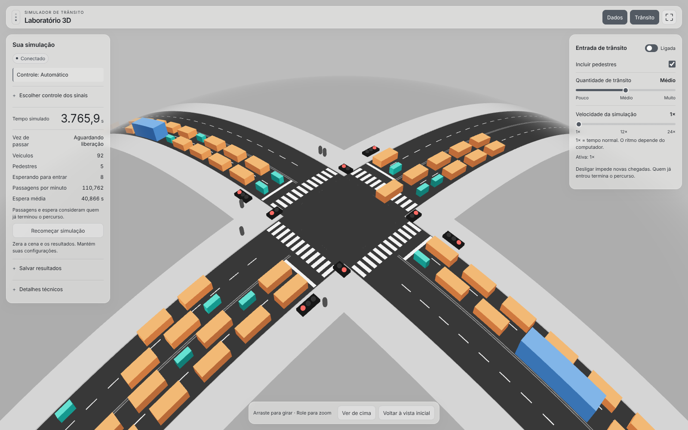
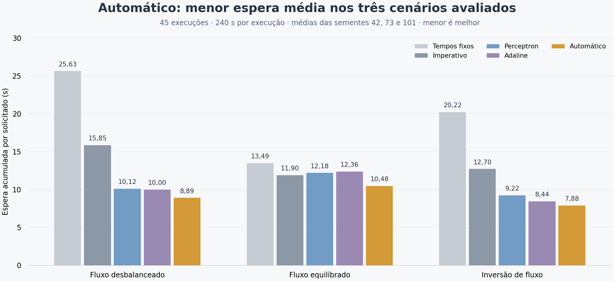
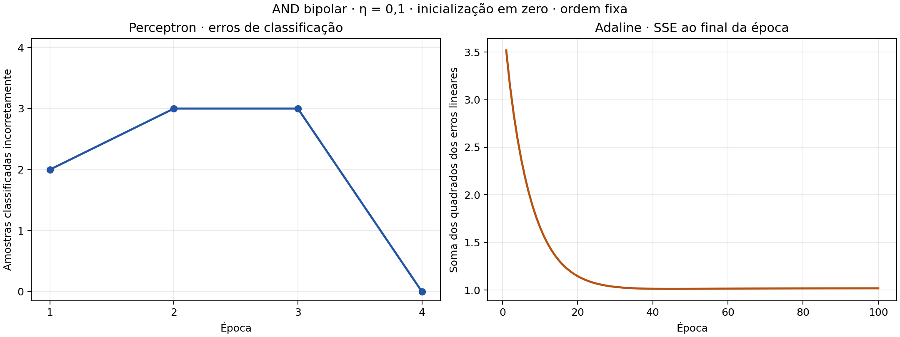
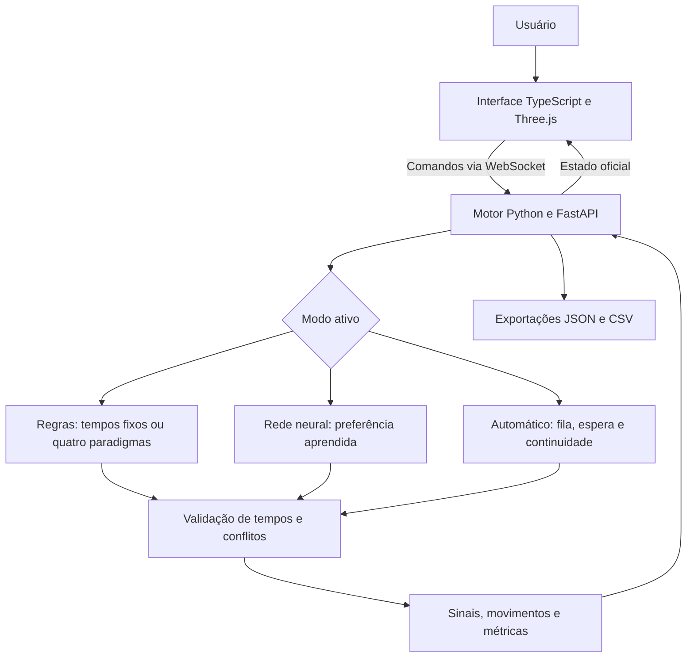

<div align="center">

# 🚦 Laboratório de Semáforos Inteligentes

**Um cruzamento 3D para comparar decisões, aprender redes neurais e observar o trânsito.**


[Desempenho](#desempenho-medido) · [Paradigmas](#quatro-paradigmas-o-mesmo-problema) · [Redes neurais](#redes-neurais-perceptron-e-adaline) · [Executar](#executar-localmente) · [Apresentação](docs/apresentacao/README.md)

</div>



O laboratório simula veículos e pedestres em um cruzamento com duas faixas por sentido. O motor Python mantém o relógio, as filas, os sinais e as métricas. O navegador apresenta uma cena 3D em tela cheia, com controles de demanda, pedestres e velocidade de 1× a 24×.

**O modo Automático é o destaque da demonstração de desempenho:** obteve a menor espera média e a menor fila média nos três cenários avaliados. Os modos Regras e Rede neural permitem estudar como diferentes representações e critérios produzem decisões.

## Automático: controle orientado ao fluxo

Para demonstrar o controle aplicado, abra **Escolher controle dos sinais → Automático → Ativar automático**. O sistema inicia em Regras com tempos fixos; a ativação é explícita, e o aviso **Controle** identifica o modo em uso.

O Automático considera participantes próximos, aproximações, espera e continuidade do verde. Sua prioridade é:

1. Atender a emergência solicitada mais antiga.
2. Priorizar uma fase com espera acumulada de pelo menos 60 segundos.
3. Comparar as fases pela pontuação abaixo.

```text
pontuação = participantes próximos
          + 0,2 × participantes em aproximação
          + maior espera / 6
          + bônus de continuidade
```

O bônus vale **7** quando a fase já está verde e ainda tem participantes próximos. A estimativa de proximidade usa um horizonte de **6 segundos**. Isso favorece o escoamento de uma corrente antes de trocar o atendimento.

O verde tem mínimo de **3 segundos** e pode continuar enquanto a decisão favorecer a fase atual. Uma troca respeita **3 segundos de amarelo**, pelo menos **1 segundo de liberação** e a conclusão dos movimentos conflitantes já autorizados.

Essa política é uma heurística explícita em [motor_python/transito.py](motor_python/transito.py). Ela funciona sem consultar os pesos neurais. A eficácia observada vem da combinação de critérios de atendimento, continuidade e verde variável.

## Desempenho medido



**45 execuções independentes:** 3 cenários × 3 sementes × 5 políticas, com 240 segundos simulados por execução. Resultados atualizados em **30/09/2026**, com pedestres a **1,7 unidade/s**.

Espera acumulada por participante solicitado, em segundos; **menor é melhor**:

| Cenário | Tempos fixos | Imperativo | Perceptron | Adaline | Automático | Redução do Automático¹ |
| --- | ---: | ---: | ---: | ---: | ---: | ---: |
| Fluxo desbalanceado | 25,63 | 15,85 | 10,12 | 10,00 | **8,89** | **43,9%** |
| Fluxo equilibrado | 13,49 | 11,90 | 12,18 | 12,36 | **10,48** | **12,0%** |
| Inversão de fluxo | 20,22 | 12,70 | 9,22 | 8,44 | **7,88** | **37,9%** |

¹ Em relação ao imperativo, que representa a política comum dos quatro paradigmas. Médias das sementes 42, 73 e 101; percentuais calculados antes do arredondamento.

A medida inclui espera de concluídos, ativos e pendentes até o fim do ensaio. Ela não estima a espera futura dos participantes restantes e difere da média dos concluídos exibida no painel principal.

O Automático liderou **espera e fila médias** nesses ensaios. Não liderou todas as medidas: no fluxo equilibrado, por exemplo, o imperativo concluiu em média 308 participantes, contra 304,3 do Automático. Por isso, o [relatório completo](experimento_transito/relatorio.md) também mostra concluídos, remanescentes e emergências. Os resultados descrevem estes cenários sintéticos, sem estabelecer um ótimo para qualquer trânsito.

<details>
<summary><strong>Configuração e reprodução dos ensaios</strong></summary>

- **Desbalanceado:** 36 carros/min por origem em N/S e 6 em L/O.
- **Equilibrado:** 22 carros/min por origem.
- **Inversão:** começa em 36/6 e troca as taxas aos 120 s.
- **Todos:** 0,3 ambulância/min por origem e 1 pedestre/min por travessia; motos e ônibus com taxa zero.
- O programa verifica conflitos a cada passo e igualdade da quantidade solicitada entre políticas para cada cenário/semente.

Na raiz do projeto:

```bash
.venv/bin/python experimento_transito/comparar.py --segundos 240 --sementes 42 73 101
.venv/bin/python experimento_transito/relatorio.py
```

Os comandos atualizam os resultados, o relatório e a cópia consultada pela interface. Para um ensaio separado, use `--saida /tmp/ensaio-transito.json` no primeiro comando.

[Dados individuais](experimento_transito/resultados.json) · [Metodologia](experimento_transito/README.md) · [Registro de verificação](docs/verificacao.md)

</details>

## Quatro paradigmas: o mesmo problema

O problema é **escolher a próxima fase de atendimento**. As quatro implementações recebem o mesmo estado imutável e devolvem uma proposta: `manter`, `transicionar` ou `aguardar`.

A política `prioridades_demanda_v1` considera emergência, espera acima do limite, prioridade opcional de ônibus e maior demanda. Os desempates são determinísticos. A máquina semafórica compartilhada valida os tempos e as ocupações antes de executar qualquer proposta.

| Paradigma | Como organiza a solução | Onde facilita | Onde exige cuidado | Código |
| --- | --- | --- | --- | --- |
| **Imperativo** | Laços percorrem pedidos; variáveis acumulam quantidade e antiguidade; condicionais escolhem a prioridade | Seguir a decisão passo a passo | Manter acumuladores e ramos coerentes ao acrescentar regras | [imperativo.py](controladores/imperativo.py) |
| **Orientado a objetos** | Objetos representam demanda, regras e política de seleção | Separar responsabilidades e localizar cada regra | Mais classes e chamadas indiretas para uma política pequena | [orientado_objetos.py](controladores/orientado_objetos.py) |
| **Funcional** | Funções puras filtram, transformam e selecionam dados imutáveis | Testar decisões isoladas e compor transformações | Ler expressões compostas e acompanhar as chaves de seleção | [funcional.py](controladores/funcional.py) |
| **Lógico** | Fatos de precedência e predicados descrevem condições e relações em Prolog | Expressar elegibilidade, conflitos e prioridades como regras | Entender ordem das cláusulas, cortes e comunicação entre processos | [logico.pl](controladores/logico.pl) |

No OO, `DemandaDaFase`, as classes de regras e `PoliticaPrioridades` dividem o trabalho. No funcional, `avaliar_fase` e `decidir` fazem os cálculos; a classe existente serve apenas de adaptador. No lógico, a decisão é calculada em Prolog: o [adaptador Python](controladores/adaptador_prolog.py) transporta o estado e valida a resposta.

**Exemplo comum:** uma ambulância com emergência solicitada em L/O tem precedência sobre uma fila comum maior em N/S. Todas as implementações devem propor o mesmo destino. Uma travessia conflitante em andamento continua protegida pelo motor.

Os [testes de paradigmas](tests/test_paradigmas.py) comparam prioridades, empates, 500 estados aleatórios e execuções completas. Essa equivalência permite discutir organização e manutenção do código sem atribuir diferenças de trânsito à sintaxe do paradigma. A referência **Tempos fixos** usa outra política e fica em [controle.py](motor_python/controle.py).

[Contrato e desempates](controladores/README.md) · [Roteiro para apresentar Paradigmas](docs/apresentacao/paradigmas.md)

## Redes neurais: Perceptron e Adaline

O projeto implementa manualmente dois neurônios artificiais clássicos, com **NumPy e Matplotlib**. O exercício acadêmico aprende a porta AND; uma extensão separada aprende preferências entre fases de trânsito.

### 1. Experimento obrigatório: AND bipolar

Entradas binárias e saída desejada bipolar:

| x₁ | x₂ | d |
| ---: | ---: | ---: |
| 0 | 0 | −1 |
| 0 | 1 | −1 |
| 1 | 0 | −1 |
| 1 | 1 | +1 |

O vetor é `x = [1, x₁, x₂]`, com o bias associado a `w₀`. A soma linear é `u = w·x`. Na predição, `sinal(u)` retorna +1 quando `u ≥ 0` e −1 nos demais casos.

| Aspecto | Perceptron | Adaline |
| --- | --- | --- |
| Erro usado na atualização | `d − y`, após o sinal | `d − u`, antes do sinal |
| Regra implementada | `w ← w + η(d − y)x` | `w ← w + η(d − u)x` |
| O que acompanha por época | Quantidade de classificações erradas | Soma dos erros quadráticos: `SSE = Σ(d − u)²` |
| Quando uma amostra já está na classe correta | Não corrige os pesos | Ainda pode corrigir o erro linear |
| Parada | Época inteira sem erros, ou limite | Variação absoluta de SSE abaixo de `10⁻⁶`, ou limite |
| Resultado obtido | **4 épocas; 4/4 acertos** | **100 épocas; 4/4 acertos** |

Ambos começam com pesos zero, taxa **η = 0,1**, mesma ordem de amostras e limite de **100 épocas**. No Adaline, o SSE é recalculado com os pesos finais de cada época. O sinal participa apenas da predição.



O Adaline terminou pelo limite de épocas: SSE final de aproximadamente **1,01822337** e última variação de **0,0000206593**, acima da tolerância. Acertar as quatro classes não significa zerar o erro linear. As atualizações por amostra também não garantem queda monotônica do SSE; o histórico registra 55 aumentos entre épocas.

A fronteira de decisão de ambos é `w₀ + w₁x₁ + w₂x₂ = 0`. Os [pesos exportados](pesos_neurais.json) preservam a precisão completa: no Perceptron, uma entrada ficou muito próxima da fronteira, e arredondar o bias pode mudar sua classificação.

O [notebook](experimento_neural/and_perceptron_adaline.ipynb) reúne treinamento, métricas por época, tabela de pesos, retas, comparação e predição interativa com tratamento de entradas inválidas. No laboratório, **Regras → Para estudar: lógica AND** usa pedido de atendimento e admissibilidade como entradas; os modelos reproduzem a conjunção que define elegibilidade.

### 2. Extensão: preferência neural no trânsito

A aba **Rede neural** usa outro conjunto de pesos, treinado com 2.400 exemplos sintéticos e avaliado em 1.200 exemplos separados, com semente **20260928**.

```text
x = [1, Δfila_próxima / 20, Δespera / 60, Δaproximações / 20, troca]
u = w·x
saída +1 → prefere a fase candidata
saída −1 → conserva a preferência atual
```

Os alvos de treinamento seguem a preferência sintética `sinal(Δfila + 0,5·Δespera + 0,2·Δaproximação − 0,12·troca)`, usando diferenças já normalizadas. A rede aprende essa preferência supervisionada; não recebe dados de uma cidade nem aprende por reforço.

| Modelo aplicado | Épocas | Acerto no teste sintético |
| --- | ---: | ---: |
| Perceptron | 70 | 100% |
| Adaline | 2 | 93,75% |

Esses percentuais medem imitação da preferência, enquanto o relatório de trânsito mede espera e atendimento. No cenário equilibrado, por exemplo, as redes aumentaram a espera em **2,4%** e **3,8%** frente ao imperativo. Os modos aplicados usam também verde variável, por isso os ensaios não isolam o efeito do aprendizado.

[Experimento AND](experimento_neural/README.md) · [Treinamento aplicado](experimento_transito/treinar.py) · [Roteiro para apresentar Redes Neurais](docs/apresentacao/redes_neurais.md)

## Arquitetura e execução



O Python mantém passos de **0,1 segundo simulado**. A aceleração de 1× a 24× altera o agendamento; as regras, as taxas por minuto simulado e os cálculos são preservados. Na execução acelerada, a publicação periódica para a tela fica limitada a 20 estados por segundo real. O ritmo alcançado depende do computador.

Veículos respeitam retenção e distância de seguimento. Pedestres autorizados concluem a travessia mesmo após o fechamento do sinal. O gerador usa chegadas Poisson com semente configurável; desligar uma fonte impede novas chegadas e preserva os pedidos já aceitos.

## Executar localmente

Pré-requisitos: **Python 3.12**, **Node.js ≥ 18.19**, npm e **SWI-Prolog** para o controlador lógico. Comandos para Bash, a partir da raiz do repositório.

**Terminal 1 — motor:**

```bash
python3.12 -m venv .venv
.venv/bin/python -m pip install -r motor_python/requirements.txt
.venv/bin/python -m uvicorn motor_python.main:app --host 127.0.0.1 --port 8000 --workers 1
```

**Terminal 2 — interface:**

```bash
cd cena_3d
npm ci
npm run dev
```

Abra o endereço informado pelo Vite, normalmente **http://127.0.0.1:5173**. A conexão padrão é `ws://127.0.0.1:8000/ws`. Use um worker: cada processo mantém sua própria simulação em memória.

<details>
<summary><strong>Prolog, outra porta e notebook</strong></summary>

Em Debian/Ubuntu, instale e verifique o Prolog:

```bash
sudo apt install swi-prolog-nox
swipl --version
swipl -q -g "use_module(library(mqi)),halt"
```

Sem SWI-Prolog/MQI, os demais controladores permanecem disponíveis. Para outra porta do motor, copie `cena_3d/.env.example` para `cena_3d/.env.local`, ajuste `VITE_WS_URL` e reinicie o Vite.

O experimento AND usa ambiente próprio:

```bash
cd experimento_neural
python3.12 -m venv .venv
.venv/bin/python -m pip install -r requirements-jupyter.txt
.venv/bin/python -m jupyter lab and_perceptron_adaline.ipynb
```

Execute as células em ordem. A última recebe `0`, `1` ou `sair` pelo teclado. Os pesos e as figuras já estão incluídos no repositório; não é necessário treinar para abrir o laboratório.

</details>

### Demonstrar o laboratório

1. Ative **Automático** para mostrar o controle orientado ao fluxo.
2. Em **Trânsito**, ligue **Entrada de trânsito** e ajuste a quantidade. **Incluir pedestres** controla suas novas chegadas.
3. Ajuste a velocidade entre 1× e 24×. Use **Dados** e **Trânsito** para recolher os painéis e ⛶ para tela cheia.
4. Explore **Regras** para comparar paradigmas e **Rede neural** para observar a política aprendida. Abrir uma aba não ativa o modo.
5. Exporte JSON ou CSV em **Salvar resultados** antes de **Recomeçar simulação**. O reinício limpa a execução e mantém as configurações.

Trocar o controlador durante uma sessão acumula resultados de políticas diferentes. Para comparar desempenho, use os ensaios independentes descritos acima.

## Organização do repositório

| Pasta ou arquivo | Conteúdo |
| --- | --- |
| [motor_python/](motor_python/README.md) | Motor, API, sinais, métricas e mapa dos métodos principais |
| [controladores/](controladores/README.md) | Contratos e quatro implementações da política de prioridades |
| [experimento_neural/](experimento_neural/README.md) | Notebook AND, validação e figuras |
| [experimento_transito/](experimento_transito/README.md) | Treinamento aplicado, ensaios e resultados |
| [cena_3d/](cena_3d/README.md) | Interface Three.js e testes de navegador |
| [tests/](tests/README.md) | Testes do motor, integração e equivalência |
| [docs/apresentacao/](docs/apresentacao/README.md) | Roteiros por disciplina, com ordem de leitura dos arquivos |
| [docs/parametros.md](docs/parametros.md) | Valores atuais e seus arquivos de origem |
| [docs/historico/](docs/historico/README.md) | Requisitos e resultados de versões anteriores |
| [pesos_neurais.json](pesos_neurais.json) | Pesos e históricos da AND carregados pelo motor |

[Índice da documentação](docs/README.md) · [Guia técnico](docs/funcionamento.md) · [Protocolo WebSocket](motor_python/PROTOCOLO.md)

## Verificação

A verificação reúne **362 testes do back-end**, **15 testes independentes do experimento AND** e **32 testes de navegador**, todos aprovados. A compilação de produção da interface também passou. O treinamento aplicado reproduziu os pesos existentes, e os resultados atuais vêm dos 45 ensaios registrados em [docs/verificacao.md](docs/verificacao.md).

```bash
# Motor e controladores; requer SWI-Prolog
.venv/bin/python -m pip install -r motor_python/requirements-dev.txt
.venv/bin/python -m pytest -q

# Experimento AND; requer o ambiente numérico do experimento
experimento_neural/.venv/bin/python experimento_neural/verificar_experimento.py

# Interface
cd cena_3d
npm run build
npx playwright install chromium
npm test -- --workers=1
```

Os testes de navegador iniciam serviços nas portas 8001 e 5174, que precisam estar livres.

## Alcance do modelo

O cenário é didático, com dados sintéticos e movimentos retos. Os ensaios não representam validação para operação viária real nem benchmark de velocidade de CPU entre paradigmas.

A simulação continua sem clientes conectados. Há reinício e aceleração; pausa e avanço manual não estão disponíveis. Eventos e séries ficam em memória até o reinício, com exportação manual. Não há replay nem comparação simultânea de execuções na tela; a tabela de desempenho é carregada dos ensaios salvos.

---

Desenvolvido por [Caio Simões Martins](https://github.com/C4ioSimoes).
