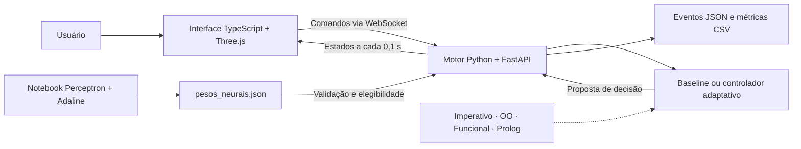

<div align="center">

## Três modos de apresentação

O laboratório agora separa **Paradigmas**, **Redes neurais** (AND obrigatória e aplicação adicional no trânsito) e **Semáforo urbano** (controle próprio com verde variável). Consulte o [roteiro das três disciplinas](docs/tres_disciplinas.md) e a [comparação medida](experimento_transito/relatorio.md). As implementações dos quatro paradigmas e o notebook AND foram preservados. As seções abaixo descrevem também o experimento original.

# 🚦 Laboratório de Semáforos Inteligentes

**Um cruzamento 3D para explorar tráfego, paradigmas de programação e redes neurais.**


[Demonstração](#-demonstração) · [Como executar](#-como-executar) · [Arquitetura](#-arquitetura) · [Documentação](#-documentação)

</div>

Um laboratório didático que simula veículos e pedestres em um cruzamento, com visualização em tempo real no navegador. O motor Python mantém o estado oficial da simulação; a cena Three.js mostra as posições, os semáforos e os resultados recebidos por WebSocket.

O projeto reúne uma baseline de ciclo fixo, **quatro implementações independentes de uma política adaptativa** e um experimento de **Perceptron e Adaline treinados manualmente para a função AND bipolar**.

## 📸 Demonstração


*Captura da aplicação local em execução, com geração automática de participantes ativada.*

## ✨ O que você pode explorar

| Recurso | Na prática |
| --- | --- |
| **Cruzamento 3D** | Câmera orbital, zoom, vista superior, semáforos e participantes animados. |
| **Trânsito e pedestres** | Carros, motos, ônibus e ambulâncias nas duas faixas de cada sentido, com filas independentes, retenção no vermelho e travessias coletivas. |
| **Demanda automática** | Chegadas Poisson, semente configurável pelo protocolo e intensidade ajustável na interface. |
| **Quatro paradigmas** | A mesma política adaptativa escrita em estilo imperativo, orientado a objetos, funcional e lógico. |
| **Prioridades** | Emergências, espera acima do limiar, ônibus e volume de demanda, respeitando as transições e ocupações. |
| **Redes neurais** | Seleção entre AND de referência, Perceptron e Adaline, com diagnóstico dos cálculos por fase. |
| **Métricas e exportação** | Vazão, espera e filas, além de eventos em JSON e séries de métricas em CSV. |
| **Sincronização** | Um único relógio Python, com passo de **0,1 segundo**, compartilhado pelos clientes. |

## 🚀 Como executar

### Pré-requisitos

- **Python 3.12** — ambiente validado com 3.12.3.
- **Node.js 18.19 ou superior** e npm, conforme `cena_3d/package.json`.
- **Git**, para clonar o repositório.
- **SWI-Prolog**, para usar o controlador lógico e executar a suíte Python completa.

Os comandos abaixo usam Bash em Linux/macOS. No Windows, a ativação do ambiente no PowerShell é `.venv\Scripts\Activate.ps1`.

### 1. Clone o projeto

```bash
git clone https://github.com/C4ioSimoes/lab_semaforos_inteligentes.git
cd lab_semaforos_inteligentes
```

### 2. Inicie o motor Python

Na raiz do projeto:

```bash
python3.12 -m venv .venv
source .venv/bin/activate
python -m pip install -r motor_python/requirements.txt
python -m uvicorn motor_python.main:app --host 127.0.0.1 --port 8000 --workers 1
```

Use **um único worker**: o estado da simulação fica na memória desse processo. Reiniciar o servidor inicia uma nova execução.

### 3. Inicie a interface

Em outro terminal, a partir da raiz:

```bash
cd cena_3d
npm ci
npm run dev
```

Abra o endereço informado pelo Vite, normalmente **http://127.0.0.1:5173**. A interface se conecta ao motor em `ws://127.0.0.1:8000/ws`.

Para alterar o endereço do motor, copie `cena_3d/.env.example` para `cena_3d/.env.local`, edite `VITE_WS_URL` e reinicie o Vite.

### 4. Experimente o cruzamento

1. Ative **Geração aleatória**: a simulação começa com a geração desligada.
2. Ajuste **Intensidade do trânsito** e acompanhe veículos, pedestres, vazão e espera média.
3. Abra **Configurações do experimento → Paradigmas** para trocar o controlador e ajustar prioridades.
4. Na aba **Redes neurais**, selecione um modelo e confira o diagnóstico por fase.
5. Exporte eventos em **JSON** e métricas em **CSV** antes de encerrar o motor.

Desligar a geração interrompe novas chegadas; participantes e pedidos já aceitos continuam sendo atendidos. A inserção manual está disponível pela API WebSocket, conforme o [protocolo](motor_python/PROTOCOLO.md).

<details>
<summary><strong>Instalar o controlador lógico com SWI-Prolog</strong></summary>

Em Debian/Ubuntu:

```bash
sudo apt install swi-prolog-nox
swipl --version
swipl -q -g "use_module(library(mqi)),halt"
```

Ambiente validado: SWI-Prolog **9.0.4** e `swiplserver` **1.0.2**. A biblioteca Python já está incluída nas dependências do motor. A integração mantém uma sessão Prolog persistente por meio da MQI.

Sem SWI-Prolog/MQI, a seleção do controlador lógico é rejeitada com uma mensagem explícita. Os demais controladores podem ser usados sem essa instalação.

</details>

## 🧭 Arquitetura



**O motor decide; o navegador apresenta.** Relógio, posições, filas, admissões e métricas pertencem ao Python. Os controladores propõem ações, e o motor valida conflitos, tempos mínimos, amarelo e liberação antes de alterar os sinais.

### Uma política, quatro paradigmas

| Controlador | Implementação |
| --- | --- |
| Baseline | Ciclo fixo Norte/Sul → Leste/Oeste → Pedestres. |
| Imperativo | Laços, variáveis locais e condicionais. |
| Orientado a objetos | Objetos de domínio e regras de prioridade. |
| Funcional | Funções puras, composição e estruturas imutáveis. |
| Lógico | Fatos e regras Prolog consultados por MQI. |

Os quatro adaptativos seguem a política `prioridades_demanda_v1`: proteção das transições e movimentos → emergências → espera excessiva → ônibus → maior demanda. A prioridade de ônibus é opcional e começa desabilitada. Consulte os [contratos e critérios de desempate](controladores/README.md).

## 🧠 Experimento neural

O [notebook](experimento_neural/and_perceptron_adaline.ipynb) implementa o treinamento com **NumPy e Matplotlib**, sem modelos prontos. Ele registra atualizações de pesos, curvas de aprendizado, fronteiras de decisão e comparação dos resultados.

| Modelo | Épocas registradas | Resultado na AND bipolar |
| --- | ---: | --- |
| Perceptron | 4 | 4/4 combinações corretas |
| Adaline | 100 | 4/4 combinações corretas; parada pelo limite de épocas |

No motor, as entradas representam **solicitação de atendimento** e **admissibilidade da fase**. A saída determina a elegibilidade para abertura, preservando as regras de segurança da simulação. Reproduzir a AND não demonstra melhoria de desempenho no trânsito.


O experimento usa ambiente Python próprio. Veja [como abrir, reproduzir e validar os resultados](experimento_neural/README.md).

## 🧪 Verificação

### Motor e controladores

Com a `.venv` da raiz ativada e o SWI-Prolog instalado:

```bash
python -m pip install -r motor_python/requirements-dev.txt
python -m pytest -q
```

### Interface e testes de navegador

```bash
cd cena_3d
npm run build
npx playwright install chromium
npm test
```

O Playwright inicia os serviços de teste nas portas **8001** e **5174**, usando a `.venv` da raiz. Mantenha essas portas livres. Em Linux, caso faltem bibliotecas do navegador, use `npx playwright install --with-deps chromium`.

As suítes cobrem relógio, filas, travessias, prioridades, equivalência dos paradigmas, integração Prolog, modelos neurais, WebSocket, interface responsiva e exportações.

## 📁 Estrutura do projeto

```text
lab_semaforos_inteligentes/
├── cena_3d/                # Interface TypeScript, Three.js e testes Playwright
├── controladores/         # Política adaptativa em quatro paradigmas
├── motor_python/          # Motor, API, métricas e protocolo WebSocket
├── experimento_neural/    # Notebook, treinamento e artefatos do experimento
├── tests/                 # Testes Python e integração
├── docs/                  # Guia técnico e imagens da documentação
├── pesos_neurais.json      # Pesos e metadados carregados pelo motor
└── requisitos.md           # Especificação original do laboratório
```

## 📚 Documentação

| Documento | Conteúdo |
| --- | --- |
| [Guia técnico](docs/funcionamento.md) | Funcionamento detalhado, limites operacionais, controle e exportações. |
| [Cena 3D](cena_3d/README.md) | Interface, câmera, geração e apresentação dos participantes. |
| [Controladores](controladores/README.md) | Política, paradigmas, prioridades e integração Prolog. |
| [Protocolo WebSocket](motor_python/PROTOCOLO.md) | Comandos, confirmações, estados e contratos de comunicação. |
| [Experimento neural](experimento_neural/README.md) | Instalação, treinamento, resultados e contrato dos pesos. |
| [Requisitos](requisitos.md) | Escopo e requisitos originais do projeto. |

## 🚧 Estado atual

O laboratório possui implementações dos incrementos M1–M7 e continua em desenvolvimento. Nem todos os requisitos originais estão concluídos.

- Pausa, retomada, reinício pela interface, passo manual e velocidades selecionáveis estão pendentes.
- A simulação continua avançando mesmo sem clientes conectados.
- Eventos e séries ficam em memória: **exporte antes de reiniciar**. Persistência automática e replay estão pendentes.
- Comparação simultânea, carregamento completo de cenários e conversões adicionais ainda não estão disponíveis.
- O cenário é didático, sem calibração para operação de trânsito real.

---

<div align="center">

Desenvolvido por [Caio Simões Martins](https://github.com/C4ioSimoes) · Simulação, programação e aprendizado em um só cruzamento.

</div>
